# Architecture — Phase 3

**Version:** v1.3.0  
**Last Updated:** October 26, 2025

---

## System Overview

The Red River Sales MCP API is a FastAPI-based system that integrates Terminal UI, AI routing, sales data management, and Obsidian dashboard generation. Phase 3 introduces multi-model AI support, system monitoring, Federal FY routing, and automated dashboard creation.

---

## High-Level Architecture

```mermaid
graph TB
    subgraph "Client Layer"
        TUI[Textual TUI<br/>Interactive Interface]
        CLI[CLI Tools<br/>Scripts & Automation]
        API_CLIENT[API Clients<br/>External Systems]
    end
    
    subgraph "API Layer - FastAPI"
        MIDDLEWARE[Middleware<br/>• Request ID<br/>• Latency Tracking<br/>• Action Logging]
        ROUTER[API Router<br/>FastAPI Routes]
        
        subgraph "Endpoints v1"
            AI_EP[AI Endpoints<br/>/v1/ai/*]
            SYS_EP[System Endpoints<br/>/v1/system/*]
            OBS_EP[Obsidian Endpoints<br/>/v1/obsidian/*]
            CONT_EP[Contacts Endpoints<br/>/v1/contacts/*]
            OEM_EP[OEM Endpoints<br/>/v1/oems/*]
            CONTRACT_EP[Contract Endpoints<br/>/v1/contracts/*]
            EMAIL_EP[Email Endpoints<br/>/v1/email/*]
        end
    end
    
    subgraph "Core Services"
        AI_ROUTER[AI Router<br/>• 6 Models<br/>• 3 Providers<br/>• Validation]
        STORE[State Store<br/>• Atomic Writes<br/>• JSON Persistence]
        FY_CALC[FY Calculator<br/>• Date Parsing<br/>• Folder Routing]
        LOGGER[JSON Logger<br/>• Structured Logs<br/>• Request Tracking]
    end
    
    subgraph "Data Storage"
        STATE_JSON[(state.json<br/>• OEMs<br/>• Contracts<br/>• Recent Actions<br/>• Contacts)]
        OBS_VAULT[Obsidian Vault<br/>40 Projects/Opportunities/]
        DASHBOARD[Dashboard Files<br/>50 Dashboards/]
    end
    
    subgraph "AI Providers"
        OPENAI[OpenAI<br/>• gpt-5-thinking<br/>• gpt-4-turbo]
        ANTHROPIC[Anthropic<br/>• claude-3.5<br/>• claude-3-opus]
        GEMINI[Gemini<br/>• gemini-1.5-pro<br/>• gemini-1.5-flash]
    end
    
    TUI --> ROUTER
    CLI --> ROUTER
    API_CLIENT --> ROUTER
    
    ROUTER --> MIDDLEWARE
    MIDDLEWARE --> AI_EP
    MIDDLEWARE --> SYS_EP
    MIDDLEWARE --> OBS_EP
    MIDDLEWARE --> CONT_EP
    MIDDLEWARE --> OEM_EP
    MIDDLEWARE --> CONTRACT_EP
    MIDDLEWARE --> EMAIL_EP
    
    AI_EP --> AI_ROUTER
    SYS_EP --> STORE
    OBS_EP --> FY_CALC
    OBS_EP --> STORE
    CONT_EP --> STORE
    OEM_EP --> STORE
    CONTRACT_EP --> STORE
    
    MIDDLEWARE --> LOGGER
    MIDDLEWARE --> STORE
    
    AI_ROUTER -.-> OPENAI
    AI_ROUTER -.-> ANTHROPIC
    AI_ROUTER -.-> GEMINI
    
    FY_CALC --> OBS_VAULT
    STORE --> STATE_JSON
    
    OBS_VAULT --> DASHBOARD
    
    style AI_ROUTER fill:#e1f5ff
    style MIDDLEWARE fill:#fff4e1
    style STORE fill:#f0f0f0
    style STATE_JSON fill:#ffe1e1
    style OBS_VAULT fill:#e1ffe1
    style DASHBOARD fill:#ffe1ff
```



---

## Component Details

### 1. Client Layer

#### Textual TUI (`tui/`)
- **Purpose:** Interactive terminal interface for sales operations
- **Features:**
  - RFQ management dashboard
  - Analytics views
  - OEM/Contract CRUD
  - AI guidance interface
  - IntroMail analysis
- **Technology:** Textual (Python TUI framework)

#### CLI Tools (`scripts/`)
- Development server (`dev.sh`)
- Test runner (`test.sh`)
- Linter (`lint.sh`)
- Build validation (`build.sh`)

#### API Clients
- External integrations
- Webhook consumers
- Automated scripts

---

### 2. API Layer (FastAPI)

#### Middleware Stack
```python
Request → Assign UUID → Process → Calculate Latency → Log Action → Response
         (request_id)              (x-latency-ms)   (state.json)
```

**Middleware Functions:**
- `add_request_id_and_latency()` - Request tracking
- `log_action_to_state()` - Action persistence

**Headers Added:**
- `x-request-id`: UUID4 for distributed tracing
- `x-latency-ms`: Request duration in milliseconds

#### API Endpoints

**AI Endpoints** (`mcp/api/v1/ai.py`)
```
POST /v1/ai/ask              - Unified AI query interface
GET  /v1/ai/models           - List available models (6 models)
GET  /v1/ai/models/detailed  - Detailed model info with providers
POST /v1/ai/guidance         - Generate RFQ guidance
```

**System Endpoints** (`mcp/api/v1/system.py`)
```
GET /v1/system/recent-actions - Last 10 API requests with metadata
```

**Obsidian Endpoints** (`mcp/api/v1/obsidian.py`)
```
POST /v1/obsidian/opportunity - Create opportunity note with FY routing
```

**Contact Endpoints** (`mcp/api/v1/contacts.py`)
```
GET /v1/contacts/export.csv - Export contacts as CSV
GET /v1/contacts/export.vcf - Export contacts as vCard 3.0
```

**OEM Endpoints** (`mcp/api/v1/oems.py`)
```
GET    /v1/oems        - List all OEMs
POST   /v1/oems        - Create OEM
PATCH  /v1/oems/{name} - Update OEM
DELETE /v1/oems/{name} - Delete OEM
```

**Contract Endpoints** (`mcp/api/v1/contracts.py`)
```
GET    /v1/contracts        - List all contracts
POST   /v1/contracts        - Create contract
PATCH  /v1/contracts/{name} - Update contract
DELETE /v1/contracts/{name} - Delete contract
```

**Email Endpoints** (`mcp/api/v1/email.py`)
```
POST /v1/email/rfq/ingest       - Ingest RFQ email
POST /v1/email/govly/ingest     - Ingest Govly event
POST /v1/email/intromail/ingest - Ingest IntroMail
```

---

### 3. Core Services

#### AI Router (`mcp/core/ai_router.py`)

**Purpose:** Unified AI model management and routing

**Data Structure:**
```python
AVAILABLE_MODELS = {
    "gpt-5-thinking": {
        "provider": "openai",
        "name": "GPT-5 Thinking"
    },
    "gpt-4-turbo": {
        "provider": "openai",
        "name": "GPT-4 Turbo"
    },
    "claude-3.5": {
        "provider": "anthropic",
        "name": "Claude 3.5 Sonnet"
    },
    "claude-3-opus": {
        "provider": "anthropic",
        "name": "Claude 3 Opus"
    },
    "gemini-1.5-pro": {
        "provider": "gemini",
        "name": "Gemini 1.5 Pro"
    },
    "gemini-1.5-flash": {
        "provider": "gemini",
        "name": "Gemini 1.5 Flash"
    }
}
```

**Functions:**
- `select_model(name)` - Validates and selects AI model
- `process_ai_request(query, model, context)` - Processes unified requests
- `get_available_models()` - Returns model registry
- `generate_guidance(payload)` - RFQ-specific guidance generation

**Validation Flow:**
```
Request → Validate Model → Found? → Process Request
                 ↓                ↓
              Not Found    Fallback to gpt-5-thinking
```

#### State Store (`mcp/core/store.py`)

**Purpose:** Atomic JSON persistence for application state

**Operations:**
- `read_json(path)` - Read JSON file
- `write_json(path, data)` - Atomic write (temp file + rename)

**Atomic Write Pattern:**
```
1. Write to temp file: .state.json.tmp
2. Flush to disk: fsync()
3. Atomic rename: os.replace(temp, target)
```

**Ensures:**
- No partial writes
- No data corruption
- ACID-like guarantees

#### FY Calculator (`mcp/api/v1/obsidian.py`)

**Purpose:** Calculate Federal Fiscal Year from close date

**Algorithm:**
```python
def get_federal_fy(close_date_str: str) -> str:
    date = parse(close_date_str)  # YYYY-MM-DD
    
    if date.month >= 10:  # Oct-Dec
        fy_year = date.year + 1
    else:  # Jan-Sep
        fy_year = date.year
    
    return f"FY{fy_year % 100:02d}"  # Last 2 digits
```

**Routing Table:**
| Date | Month | Calculation | Result |
|------|-------|-------------|--------|
| 2024-11-15 | Nov (≥10) | 2024 + 1 = 2025 | FY25 |
| 2025-03-20 | Mar (<10) | 2025 | FY25 |
| 2025-10-01 | Oct (≥10) | 2025 + 1 = 2026 | FY26 |
| Invalid | N/A | Exception | Triage |

#### JSON Logger (`mcp/core/logging.py`)

**Purpose:** Structured JSON logging with request tracking

**Log Format:**
```json
{
  "timestamp": "2025-10-26 01:30:45,123",
  "level": "INFO",
  "message": "POST /v1/ai/ask 200",
  "request_id": "a1b2c3d4-e5f6-4789-a0b1-c2d3e4f5g6h7",
  "latency_ms": 2.34,
  "method": "POST",
  "path": "/v1/ai/ask",
  "status": 200
}
```

---

### 4. Data Storage

#### state.json

**Structure:**
```json
{
  "oems": [
    {"name": "Dell", "authorized": true, "threshold": 500000}
  ],
  "contracts": [
    {"name": "GSA Schedule", "supported": true, "notes": "..."}
  ],
  "contacts": [
    {"name": "John Doe", "email": "john@example.com", ...}
  ],
  "recent_actions": [
    {
      "request_id": "uuid",
      "timestamp": "ISO8601",
      "method": "POST",
      "path": "/v1/ai/ask",
      "latency_ms": 2,
      "status_code": 200,
      "context": {}
    }
    // ... up to 10 entries (oldest removed on rotation)
  ],
  "selected_ai": "gpt-5-thinking"
}
```

**Rotation Logic:**
```python
recent_actions.insert(0, new_action)  # Add to front
recent_actions = recent_actions[:10]  # Keep only 10
```

#### Obsidian Vault

**Directory Structure:**
```
obsidian/
├── 40 Projects/
│   └── Opportunities/
│       ├── FY24/
│       │   └── OPP-001 - Legacy Project.md
│       ├── FY25/
│       │   ├── OPP-010 - Cloud Strategy.md
│       │   └── OPP-011 - Security Upgrade.md
│       ├── FY26/
│       │   └── OPP-020 - AI Implementation.md
│       └── Triage/
│           └── OPP-999 - Invalid Date.md
├── 50 Dashboards/
│   └── Opportunities Dashboard.md
└── 60 Projects/
    └── MCP (DealCraft)/
        └── 90_KiloCode_Sprint/
            └── summaries/
                └── 2025-10-26-phase3-integration-summary.md
```

**Note Format:**
```markdown
---
id: OPP-010
title: "Cloud Strategy Initiative"
customer: Federal Agency X
oem: AWS
amount: 500000.0
stage: Qualification
close_date: 2025-06-30
source: RFQ
type: opportunity

# Dashboard aliases
est_amount: 500000.0
est_close: 2025-06-30
oems:
  - AWS
partners: []
contract_vehicle: ""

tags:
  - opportunity
  - cloud
---

# Cloud Strategy Initiative

## Summary
- **Customer:** Federal Agency X
- **OEM:** AWS
- **Amount:** $500000.0
...
```

#### Dashboard Files

**Opportunities Dashboard** (`50 Dashboards/Opportunities Dashboard.md`)

**Dataview Query Example:**
```dataview
TABLE WITHOUT ID
  file.link AS Opportunity,
  customer AS Customer,
  (oems ?? [oem]) AS OEMs,
  (amount ?? est_amount) AS "Est. Amount"
FROM "40 Projects/Opportunities"
WHERE type = "opportunity"
SORT (amount ?? est_amount) DESC
```

---

## Data Flow Diagrams

### Opportunity Creation Flow

```mermaid
sequenceDiagram
    participant Client
    participant API
    participant FY_Calc as FY Calculator
    participant FileSystem
    participant Dataview
    
    Client->>API: POST /v1/obsidian/opportunity
    Note over Client,API: Payload: {id, title, customer,<br/>oem, amount, stage,<br/>close_date, source, tags}
    
    API->>API: Validate Input (Pydantic)
    
    API->>FY_Calc: get_federal_fy(close_date)
    FY_Calc->>FY_Calc: Parse date<br/>Calculate FY
    FY_Calc-->>API: "FY25" or "Triage"
    
    API->>API: Generate Markdown<br/>• YAML frontmatter<br/>• YAML aliases<br/>• Body content
    
    API->>FileSystem: Write file<br/>40 Projects/Opportunities/FY25/<br/>OPP-010 - Cloud Strategy.md
    FileSystem-->>API: Success
    
    FileSystem->>Dataview: File change detected
    Dataview->>Dataview: Re-execute queries<br/>Update dashboards
    
    API-->>Client: {"path": "...", "created": true}
```



### AI Request Flow


### System Monitoring Flow


---

## Technology Stack

### Backend
- **FastAPI** - Web framework
- **Pydantic** - Data validation
- **Python 3.11+** - Runtime
- **Uvicorn** - ASGI server

### Frontend (TUI)
- **Textual** - Terminal UI framework
- **Rich** - Terminal formatting

### Storage
- **JSON** - State persistence
- **Markdown** - Obsidian notes

### Testing
- **Pytest** - Test framework (71 tests)
- **TestClient** - FastAPI testing

### Code Quality
- **Ruff** - Linter and formatter
- **Pre-commit** - Git hooks

### AI Providers (Stubbed in v1.3.0)
- **OpenAI API** - GPT models
- **Anthropic API** - Claude models
- **Google Gemini API** - Gemini models

---

## Security Considerations

### Current Implementation
- **No authentication** - Internal use only
- **Local API** - localhost:8000
- **File system access** - Unrestricted

### Future Enhancements
- API key authentication
- Rate limiting per client
- Request signing
- CORS configuration
- HTTPS/TLS support

---

## Scalability Considerations

### Current Limits
- **State file:** In-memory JSON (single file)
- **Concurrent requests:** Limited by Uvicorn workers
- **Recent actions:** Fixed at 10 entries

### Scale-Out Strategy
- Migrate to database (PostgreSQL, SQLite)
- Add Redis for caching
- Implement pagination for recent actions
- Load balancer for multiple API instances
- Message queue for async processing

---

## Monitoring & Observability

### Current Capabilities
- Request ID tracking (`x-request-id`)
- Latency measurement (`x-latency-ms`)
- Recent actions log (last 10)
- Structured JSON logging

### Future Enhancements
- Prometheus metrics export
- Grafana dashboards
- Distributed tracing (Jaeger, Zipkin)
- Error rate tracking
- SLA monitoring

---

## Deployment Architecture

### Development
```
Developer Machine
├── FastAPI (port 8000)
├── TUI (terminal)
└── Obsidian (separate app)
```

### Production (Future)
```
AWS/Cloud Infrastructure
├── Load Balancer
├── API Servers (N instances)
├── Database (RDS/Aurora)
├── Redis Cache
├── S3 (Obsidian vault backup)
└── CloudWatch Monitoring
```

---

## File Structure

```
red-river-sales-automation/
├── mcp/                     # Main application package
│   ├── api/
│   │   ├── main.py         # FastAPI app + middleware
│   │   └── v1/             # API version 1
│   │       ├── ai.py       # AI endpoints
│   │       ├── contacts.py # Contact exports
│   │       ├── contracts.py # Contract CRUD
│   │       ├── email.py    # Email ingestion
│   │       ├── obsidian.py # Obsidian integration
│   │       ├── oems.py     # OEM CRUD
│   │       └── system.py   # System monitoring
│   └── core/
│       ├── ai_router.py    # AI model routing
│       ├── config.py       # Configuration
│       ├── logging.py      # JSON logging
│       └── store.py        # State persistence
├── tui/                     # Terminal UI
│   ├── app.py              # TUI entry point
│   └── rrtui/              # UI components
├── obsidian/               # Obsidian vault
│   ├── 40 Projects/        # Opportunities (FY-routed)
│   ├── 50 Dashboards/      # Dataview dashboards
│   └── 60 Projects/        # Sprint summaries
├── data/
│   └── state.json          # Application state
├── tests/                   # Test suite
├── scripts/                 # Utility scripts
└── docs/                    # Documentation
    ├── PHASE3_OVERVIEW.md
    └── architecture_phase3.md (this file)
```

---

## API Versioning Strategy

### Current: v1
- Stable API with semantic versioning
- No breaking changes within v1.x.x

### Future: v2
- Planned for Phase 5+
- Database-backed storage
- Authentication required
- Enhanced AI features

### Deprecation Policy
- 6-month notice for breaking changes
- Parallel support for 2 major versions
- Clear migration guides

---

## Performance Targets

### Response Times
| Metric | Current | Target | Status |
|--------|---------|--------|--------|
| P50 Latency | <2ms | <10ms | ✅ Exceeds |
| P95 Latency | <5ms | <50ms | ✅ Exceeds |
| P99 Latency | <10ms | <100ms | ✅ Exceeds |

### Throughput
| Metric | Current | Target | Status |
|--------|---------|--------|--------|
| Requests/sec | ~100 | 1000 | ⚠️ Not tested |
| Concurrent users | 10 | 100 | ⚠️ Not tested |

### Test Suite
| Metric | Current | Target | Status |
|--------|---------|--------|--------|
| Execution time | ~3s | <5s | ✅ Met |
| Test count | 71 | 100+ | 🔄 Growing |
| Coverage | High | >80% | ✅ Met |

---

## Change Log Integration

See [CHANGELOG.md](../../CHANGELOG.md) for version history and [Phase 3 Overview](../guides/phase3_overview.md) for detailed feature descriptions.

---

**Architecture Status:** Current as of v1.3.0  
**Last Review:** October 26, 2025  
**Next Review:** Phase 4 planning